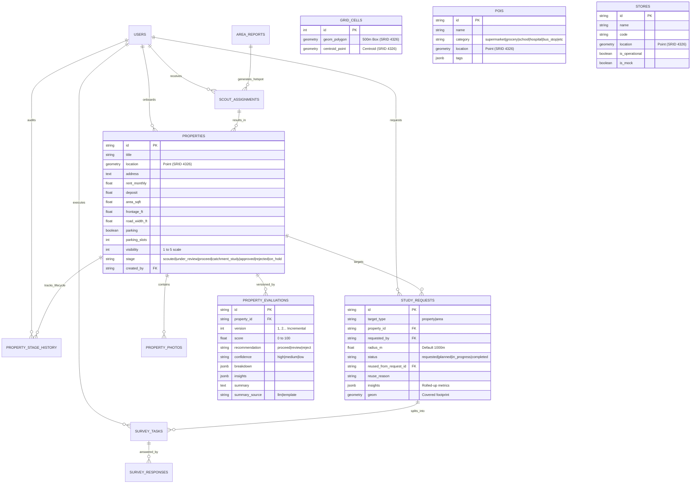

# Savo SiteScout: Chennai Retail Expansion Intelligence Platform

**Savo SiteScout** is a production-grade geospatial retail expansion intelligence platform custom-engineered for **Savomart** (grocery supermarket chain) in the **Chennai metropolitan region**.

It integrates macro-market territory analysis, on-ground mobile property scouting, and micro-lane catchment surveys into a unified, deterministic decision pipeline.

---

## Demonstration Video (3 to 5 Minutes)

> **Google Drive Link:** [https://drive.google.com/file/d/1zryiAopUNhub8CDdK3GvugbgEJ2OaExN/view?usp=sharing](https://drive.google.com/file/d/1zryiAopUNhub8CDdK3GvugbgEJ2OaExN/view?usp=sharing)  
> *(Sharing set to: "Anyone with the link can view")*  
> Walkthrough covers: All 4 organizational personas, 1-click 6-month spatial reuse, offline mobile surveys, and automated Ground-Truth property re-evaluation.

---

## System Architecture

- **Frontend Client:** React 18 + Vite with Tailwind CSS, providing desktop Leaflet mapping for BD and Survey Managers alongside responsive mobile-optimized interfaces for field scouts and lane surveyors.
- **Backend Application:** FastAPI (Python 3.12) REST API powering deterministic scoring engines, 6-month spatial reuse resolution, LPT workload bin-packing, and regex-validated LLM narratives.
- **Geospatial Database:** PostgreSQL 16 with PostGIS extension (SRID 4326), indexing 6,666 pre-calculated 500m Chennai grid cells, 2,200+ OpenStreetMap POIs, and 10 Savomart operational store buffers.

---

## Quick Start & Environment Setup

Follow this guide to clone, configure, launch, and test Savo SiteScout on any developer machine (Windows, macOS, or Linux).

---

### 1. Prerequisites
- **Git** installed ([Download Git](https://git-scm.com/))
- **Docker & Docker Compose** ([Download Docker Desktop](https://www.docker.com/products/docker-desktop/))
  * Make sure Docker Desktop is open and running before proceeding.
- *(Optional for native run: Python 3.12+, Node.js 20+)*

---

### 2. Clone the Repository & Configure Environment

Open your terminal or PowerShell and run:

```bash
# 1. Clone the repository
git clone https://github.com/AbinayaB04/savomart-fullstack-hackathon-2026.git
cd savomart-fullstack-hackathon-2026

# 2. Copy the environment configuration
# On macOS / Linux / Git Bash:
cp .env.example .env

# On Windows PowerShell:
Copy-Item .env.example .env
```

#### Understanding `.env` Port Isolation
The default `.env` is specifically engineered with **isolated host port mappings** so you never experience port collision errors with local PostgreSQL (5432) or local dev servers:

| Setting | Default Value | Why It Was Chosen |
|---|:---:|---|
| `DB_PORT` / `POSTGRES_PORT` | `5438` | Avoids collision with existing local PostgreSQL installations on port `5432`. |
| `BACKEND_PORT` | `8005` | Avoids collision with other local web services running on port `8000`. |
| `FRONTEND_PORT` | `5175` | Avoids collision with standard Vite / React dev servers on port `5173`. |
| `LLM_PROVIDER` | `none` | Works out of the box with deterministic template fallback. Set to `gemini`, `openai`, or `anthropic` and provide an API key if desired. |

---

### 3. Launch via Docker Compose (Recommended)

Start the PostGIS database, FastAPI backend, and React frontend in detached mode:

```bash
docker compose up -d --build
```

Verify that all three containers are healthy:
```bash
docker compose ps
```
You should see:
* `sitescout_postgis` — Port `5438 -> 5432` *(healthy)*
* `sitescout_backend` — Port `8005 -> 8000` *(running)*
* `sitescout_frontend` — Port `5175 -> 5173` *(running)*

---

### 4. Initialize Data & Seed Rich Demo Scenarios

Once the containers are up, execute the two automated seeding scripts inside the backend container:

```bash
# Step 4a: Foundation Setup
# Generates 6,666 500m Chennai grid cells, ingests 2,200+ OSM POIs, seeds 10 Savomart stores, and creates 8 persona users:
docker compose exec backend python /scripts/setup_all.py

# Step 4b: Rich Real-Code-Path Demo Seeding
# Seeds 3 Area Intelligence Reports (Velachery, Tambaram, Anna Nagar), 4 candidate properties, 1 completed catchment study with rolled-up pedestrian insights, and 1 planned study:
docker compose exec backend python /scripts/seed_demo.py
```

---

<<<<<<< HEAD
## Personas & Workspaces
Savo SiteScout features 4 distinct role-tailored workspaces. No passwords needed: switch personas instantly using the header dropdown, which sets `X-User-Id` on all requests.
=======
### 5. Open the Platform in Your Browser
>>>>>>> 94bd661 (ai sessions transcripts and update readme architecture)

* **Frontend Web Application:** [http://localhost:5175](http://localhost:5175)
* **Backend Interactive API Docs (Swagger):** [http://localhost:8005/docs](http://localhost:8005/docs)
* **Backend Health Check:** [http://localhost:8005/health](http://localhost:8005/health)

---

<<<<<<< HEAD
## Geospatial Focus & Data Rules
=======
### 6. Run the Automated Test Suite
>>>>>>> 94bd661 (ai sessions transcripts and update readme architecture)

Verify that all spatial algorithms, reuse rules, and LPT task balancers pass:

```bash
docker compose exec backend pytest -v
```
*(All 11 unit tests will run and pass in ~4 seconds).*

---

<<<<<<< HEAD
## API Endpoints (Phase 1)
=======
### 2-Minute Verification Tour (What to Click First)

Once you open [http://localhost:5175](http://localhost:5175), here is the quickest way to verify the entire system:

1. **Verify M1 (Area Intelligence):**
   * Keep the active persona as **`Arunachalam Muruganantham (BD Manager (Desktop))`**.
   * Click **Saved Reports** ➔ Open **Velachery Commercial Hub** ➔ See the Area Fitness Score, Cannibalization Buffer (`841m`), and **Top 5 Hotspots** (`Cell #2611`, Score 85/100).
2. **Verify M2 (Mobile Property Scouting):**
   * Switch persona dropdown (top-right) to **`Karthik Raja (BD Executive (Mobile))`**.
   * Notice the app automatically opens inside an **iPhone 15 frame**.
   * Tap **Tasks** to see assigned Hotspot #2611 ➔ Tap **Sites** to see scouted candidate properties.
3. **Verify M3 (Operations Task Dispatch):**
   * Switch persona dropdown to **`Meenakshi Sundaram (Survey Manager (Desktop))`**.
   * Click on the **Tambaram Sanatorium** study ➔ Click the purple button **`[ Auto-Assign to Executives ]`** to watch the LPT algorithm balance the 20 cells 50-50 across surveyors.
4. **Verify Offline Mobile Surveys:**
   * Switch persona dropdown to **`Kavitha Rajendran (Survey Executive (Mobile))`**.
   * Tap **Start Capture** ➔ Test the live 10-minute footfall counter (`+5`, `+1`, `Auto 6×`).
   * Toggle **Offline Mode** in the header to observe local draft preservation.
5. **The Climax — 6-Month Spatial Reuse:**
   * Switch persona back to **`Arunachalam Muruganantham (BD Manager (Desktop))`**.
   * Click **Pipeline Board** ➔ In the **Proceed** column, click **Vijayanagar Bus Terminus Commercial Space**.
   * Click the bright yellow button **`[ Request Catchment Study ]`**.
   * **Result:** The 6-Month Spatial Reuse Engine instantly detects the nearby completed study (160m away, 11 days old), copies the ground metrics with a golden banner, and updates the property to **Version 2 Ground-Truth evaluation**!

---

### Alternative: Native Local Development (Without Docker)

If you prefer running Python and Node directly on your host machine:

#### Step 1: Start only the PostGIS database container
```bash
docker compose up -d db
```

#### Step 2: Setup & Run FastAPI Backend
```bash
cd backend

# Create & activate virtual environment
python -m venv venv
# On Windows:
.\venv\Scripts\activate
# On macOS / Linux:
source venv/bin/activate

# Install dependencies
pip install -r requirements.txt

# Run initial setup scripts
python ../scripts/setup_all.py
python ../scripts/seed_demo.py

# Launch FastAPI server
uvicorn app.main:app --host 0.0.0.0 --port 8000 --reload
```

#### Step 3: Setup & Run React Frontend
In a separate terminal window:
```bash
cd frontend

# Install Node dependencies
npm install

# Start Vite dev server
npm run dev
```
Open [http://localhost:5173](http://localhost:5173) in your browser.

---

### Useful Docker Commands

| Action | Command |
|---|---|
| **View streaming logs** | `docker compose logs -f` |
| **View backend-only logs** | `docker compose logs -f backend` |
| **Restart services** | `docker compose restart` |
| **Stop all containers** | `docker compose down` |
| **Clean reset (remove volumes)** | `docker compose down -v` *(will delete database data)* |

---

## Personas & Instant Role Switcher

Savo SiteScout implements simulated, zero-password authentication. The active persona is selected via the header dropdown, persisted in `localStorage`, and sent on all HTTP calls via the `X-User-Id` header. The backend enforces role permissions using FastAPI dependencies.

| Role | Persona Name | User ID | Form Factor | What They See Immediately Upon Login |
|---|---|---|---|---|
| **BD Manager** | Arunachalam Muruganantham | `usr_bdm_1` | Desktop (1536px+) | 3 Area Intelligence Reports (Velachery, Tambaram, Anna Nagar), 4 Properties across pipeline stages, Top 5 hotspots, and 1-click Catchment Study dispatch. |
| **BD Manager (Alt)** | Deepa Subramanian | `usr_bdm_2` | Desktop (1536px+) | Alternative BD Manager with full pipeline access. |
| **BD Executive** | Karthik Raja | `usr_bde_1` | Mobile (390px) | Active Hotspot Assignment in Velachery, 3-step property onboarding wizard (GPS, commercial specs, photo upload), and submitted sites. |
| **BD Executive 2** | Sangeetha Natarajan | `usr_bde_2` | Mobile (390px) | Assigned hotspot in Anna Nagar West 2nd Avenue. |
| **Survey Manager** | Meenakshi Sundaram | `usr_sm_2` | Desktop (1536px+) | 1 Completed Catchment Study with rolled-up pedestrian insights, 1 Planned Study in Tambaram with interactive task splitting and LPT auto-assign. |
| **Survey Manager (Alt)** | Venkatesh Prasad | `usr_sm_1` | Desktop (1536px+) | Operations manager view for workload oversight. |
| **Survey Executive** | Kavitha Rajendran | `usr_se_2` | Mobile (390px) | Assigned lane survey task queue, mobile lane data capture form (10-min footfall counter, shop mix, competitors, photo upload, offline draft sync). |
| **Survey Executive 2** | Saravanan Balaji | `usr_se_1` | Mobile (390px) | Balanced survey queue in Tambaram Sanatorium grid cells. |

---

## Data Models & Schema

The relational schema is implemented in PostgreSQL 16 using PostGIS extensions (all geometries stored in **SRID 4326** with GIST indexes).



---

## Data Sources & Citations

1. **OpenStreetMap (OSM) via Overpass API:**
   - **Data Extracted:** Points of Interest (POIs) across 9 retail-relevant categories: `supermarket`, `grocery`, `convenience`, `school`, `hospital`, `bus_stop`, `rail_station`, `office`, `residential_building`.
   - **Bounding Box:** Chennai Metropolitan Area (`[12.80 - 13.25°N, 80.05 - 80.35°E]`).
   - **Citation:** *Data © OpenStreetMap contributors, licensed under the Open Database License (ODbL 1.0).*
   - **Reliability Engineering:** Multi-category queries are executed with per-category retries, exponential backoff, and local caching in `data/raw/` to ensure offline reproducibility when public Overpass servers are rate-limited.

2. **OSM Nominatim Geocoding:**
   - **Data Extracted:** Locality names, postal codes (e.g. 600042, 600040), and administrative centroids.
   - **Policy Compliance:** Hard rate-limited to $\le 1\text{ req/sec}$ with persistent storage in `geocode_cache` to prevent redundant network hits.

3. **Savomart Internal Stores API:**
   - **Endpoint:** `https://internal-service.savomart.in/bridge/api/store/list?is_operational=True` with `X-cron-token`.
   - **Graceful Fallback:** If unreachable or offline, the system seeds 10 verified operational Savomart store locations across Chennai (T. Nagar, Velachery, Anna Nagar, Adyar, Tambaram, etc.) marked with `is_mock: true` for full audit transparency.

---

## How Scoring Works

All scores are calculated using **pure Python deterministic mathematical formulas**. No random numbers or non-deterministic AI guessing is ever used in scoring.

### 1. Area Viability Scoring (0 to 100 Points)
Used by BD Managers to rank Chennai micro-markets and extract Top 5 scouting hotspots:

| Factor | Weight | PostGIS Metric & Normalization Logic |
|---|:---:|---|
| **Population Density** | **30** | Estimated transparently from OSM residential buildings: $\text{pop} = \text{buildings} \times 4.5\text{ persons}$, normalized per $\text{km}^2$ against Chennai benchmark ($25,000/\text{km}^2$). |
| **Commercial Competition** | **25** | Counts direct competitor supermarkets and groceries. Evaluated along a commercial viability curve: balanced presence indicates proven retail demand, while oversaturation ($>8\text{ stores/km}^2$) penalizes the score. |
| **Civic Amenities** | **15** | Density of schools, colleges, and hospitals within the catchment, driving footfall from students and hospital visitors. |
| **Cannibalisation Penalty** | **15** | PostGIS distance to the nearest existing Savomart store. Proximity $< 800\text{m}$ applies a linear penalty ($d/800$) to protect current revenue; distance $\ge 800\text{m}$ receives full 1.0 (no penalty). |
| **Business / Office Density** | **10** | Commercial office count per $\text{km}^2$, driving lunchtime and evening return grocery purchases. |
| **Transit Accessibility** | **5** | Density of bus stops, suburban rail stations, and Chennai Metro stations per $\text{km}^2$. |

**Rating Bands:**
- **Excellent:** $\ge 80$
- **Good:** $65 - 79$
- **Fair:** $50 - 64$
- **Poor:** $< 50$

---

### 2. Property Evaluation Scoring (0 to 100 Points)
Used when a field scout onboards a physical retail space:

| Factor | Weight | Valuation & Spatial Benchmark Logic |
|---|:---:|---|
| **Commercial & Lease Terms** | **25** | Evaluates asking rent per sqft against a zone-specific Chennai retail benchmark (₹55 - ₹105/sqft/mo). If rent is omitted, defaults to neutral and flags `confidence = "low"`. |
| **Frontage & Signage Visibility** | **20** | Glass frontage $\ge 20\text{ ft}$ optimal for supermarket branding and visibility; rated 1–5 visibility scale. |
| **Road Width & Parking Access** | **15** | Street width $\ge 30\text{ ft}$ allows delivery truck ingress; dedicated parking slots for 2-wheelers and 4-wheelers. |
| **500m Catchment Demographics** | **20** | PostGIS circular buffer query ($500\text{m}$) aggregating residential clusters and daily customer bases. |
| **Cannibalisation & Competition** | **20** | Distance to nearest Savomart ($<800\text{m}$ penalized) and competitor clustering within $500\text{m}$. |

**Recommendations:**
- **Proceed:** Score $\ge 70$
- **Review:** Score $50 - 69$
- **Reject:** Score $< 50$

---

## LLM Grounding & Hallucination Guardrails

To prevent LLM hallucinations from misleading retail executives, Savo SiteScout implements a strict **four-layer guardrail architecture**:

1. **Pure Deterministic Calculation:** All scores, ratings, distances, and POI counts are computed exclusively by Python and PostGIS before the LLM is ever called.
2. **Facts-Only Prompt Construction:** The LLM is provided only a JSON dictionary of pre-computed numeric facts and is explicitly instructed:
   > *"You are an objective retail expansion intelligence analyst. Summarize these EXACT facts. Do NOT invent numbers, percentages, distances, or metrics not provided in the input."*
3. **Strict Regex Number Whitelist Validation (`backend/app/llm/provider.py`):**
   - The system parses every single integer, float, and percentage generated in the LLM narrative using regular expressions.
   - It validates every number against the whitelist of numbers in the input facts dictionary.
   - If an unauthorized number is detected (e.g. LLM hallucinates an arbitrary footfall count or rent estimate), the narrative is **instantly rejected**.
4. **Deterministic Template Fallback:**
   - If the LLM fails validation, times out, or encounters an API rate limit, the system falls back to a deterministic, human-readable Python template narrative.
   - Every generated report explicitly tags its source in the API and UI: `summary_source = "llm"` or `summary_source = "template"`.

---

## The 6-Month Spatial Reuse Rule (Why & How)

Field surveys are labor-intensive, logistically demanding, and expensive. In dense urban retail corridors like Chennai (e.g. Velachery 100ft Bypass or T. Nagar), multiple retail sites within 100 to 200 meters of each other often enter the expansion pipeline.

### The Rule (`backend/app/studies/reuse.py`):
When a catchment study is requested for a candidate property:
1. The backend performs a PostGIS query checking if any existing **COMPLETED** study:
   - Covers the property location: `ST_Contains(study.geom, prop.location)` OR is within 300 meters: `ST_DWithin(study.geom::geography, prop.location::geography, 300.0)`.
   - **AND** was completed within the last **6 months (180 days)** (`study.completed_at >= NOW() - INTERVAL '180 days'`).
2. **If Found:**
   - The backend **does not generate redundant field survey tasks**.
   - It links the new request via `reused_from_request_id`.
   - It copies the rolled-up ground metrics (footfall averages, competitor counts, shop mix).
   - It marks the study `completed` and returns a transparent audit explanation to the UI:
     > *"Reused study #std_demo_velachery_1, covers this location, 11 days old"*
   - It immediately triggers a new version of the property evaluation (**Version 2: "Updated after catchment study"**), upgrading model estimates with ground-truth survey metrics!

### Try it in 1 Click:
1. Log in as **BD Manager**.
2. Select Property #3: **Vijayanagar Bus Terminus Commercial Space** (located 160m from Property #2).
3. Click **"Request Catchment Study"**.
4. Watch the golden reuse badge appear instantly with zero field survey wait time!

---

## Spatial Deduplication (50m Buffer + Tolerance)

To prevent multiple BD field scouts from onboarding the same property twice, `POST /properties` implements PostGIS deduplication:
- **Spatial Radius:** Checks existing properties within 50 meters using `ST_DWithin(location::geography, new_point::geography, 50.0)`.
- **Tolerance Check:** If distance $\le 50\text{m}$ AND carpet area or monthly rent is within $\pm 20\%$, the API rejects creation with `HTTP 409 Conflict` and returns potential matches.
- **Scout Override:** Field scouts can explicitly pass `force=true` if onboarding a distinct retail unit located in the same shopping complex.

---

## Pipeline State Machine & Mandatory Reason Audit

Properties advance through strict lifecycle stages:
$$\text{scouted} \longrightarrow \text{under\_review} \longrightarrow \text{proceed} \longrightarrow \text{catchment\_study} \longrightarrow \text{approved} \;\big|\; \text{rejected} \quad (\text{or } \text{on\_hold})$$

- **Role Authorization:** Only BD Managers can advance or transition property stages.
- **Mandatory Reason:** Every stage move requires a non-empty text justification (`reason`, min length 3 characters).
- **Immutable Audit Trail:** Every transition creates an immutable row in `property_stage_history` (`from_stage`, `to_stage`, `changed_by`, `reason`, `created_at`), viewable in the property detail timeline.

---

## MOCK Data Transparency Disclosure

In adherence to hackathon integrity guidelines, all fallback data is explicitly documented:

| Dataset | Nature of Data | Identifier / Flag | UI Indication |
|---|---|---|---|
| **Savomart Operational Stores** | Verified operational Chennai store coordinates seeded as fallback when internal VPN bridge is offline. | `is_mock: true` on store models and API payloads | Displayed with amber "Mock Data" tag in UI. |
| **Grid Cell Populations** | Estimated from OSM residential building polygon footprints ($\times 4.5\text{ persons}$). | Documented formula | Transparently cited in Area breakdown factor cards. |
| **Storefront & Survey Photos** | High-contrast SVG vector mock assets stored in `backend/uploads/`. | SVG files in `/uploads/` | Clear watermark: "Verified Scout Photo" / "Site Capture". |

---

## Automated Test Suite

The test suite covers deterministic scoring, boundary normalization, spatial deduplication tolerances, allowed state transitions, 6-month spatial reuse windows, and workload-balanced auto-assignment.

```bash
docker compose exec backend pytest -v
```

**Results:**
```text
tests/test_catchment_study.py::test_workload_balanced_auto_assignment PASSED
tests/test_catchment_study.py::test_study_rollup_metrics PASSED
tests/test_catchment_study.py::test_spatial_reuse_window_180_days PASSED
tests/test_property_scoring.py::test_allowed_stage_transitions PASSED
tests/test_property_scoring.py::test_rent_benchmark_lookup PASSED
tests/test_property_scoring.py::test_duplicate_check_tolerance PASSED
tests/test_scoring.py::test_weights_sum_to_100 PASSED
tests/test_scoring.py::test_normalization_bounds PASSED
tests/test_scoring.py::test_cannibalisation_penalty PASSED
tests/test_scoring.py::test_number_validator PASSED
tests/test_scoring.py::test_overall_evaluation_and_rating_bands PASSED

============================== 11 passed in 3.99s ==============================
```

---

## Design Decisions & Architectural Trade-offs

A comprehensive Architecture Decision Record (ADR) detailing all 15 technical decisions and trade-offs is maintained in [`docs/DECISIONS.md`](docs/DECISIONS.md).

---

## Known Issues & Production Improvements

1. **Overpass Public API Rate Limiting:** Public Overpass API instances occasionally return HTTP 429 during heavy queries. The ingestion script handles this with retry/backoff and cached fallback data in `data/raw/`.
2. **Future Improvement - Road Network Graph (pgRouting):** Currently cannibalisation uses PostGIS Euclidean/geodetic distance. Integrating `pgRouting` with Chennai OSM road networks will enable true drive-time and walking isochrones.
3. **Future Improvement - Real-time WebSocket Updates:** Catchment task submissions currently poll or refresh on navigation; adding WebSockets will push survey progress to the Survey Manager in real time.

---

## AI Tooling & Governance

- **AI Pair Programmer:** Google DeepMind Advanced Agentic Coding (`Antigravity IDE` / Gemini).
- **Session Audit Trails:** Complete conversation transcripts, trajectory logs, and tool execution traces are documented in [`ai-sessions/Savo SiteScout Development Setup.md`](ai-sessions/Savo%20SiteScout%20Development%20Setup.md).

